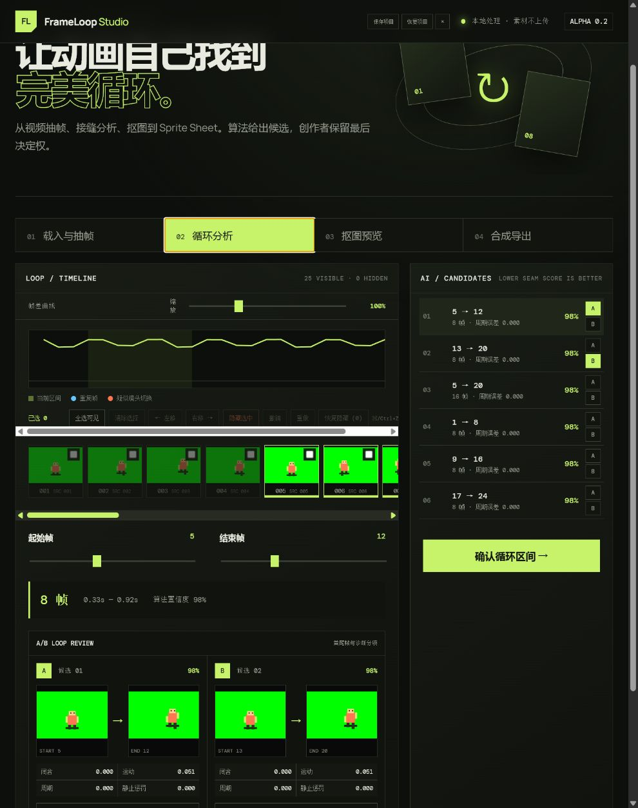

<div align="center">

# FrameLoop Studio

**让 2D 动画自己找到完美循环。**

从视频抽帧、智能循环分析、抠图修边，到 Sprite Sheet 与游戏引擎数据导出；既可以在浏览器中手动精修，也可以通过 MCP 交给 AI 完成批处理。

[](https://react.dev/)
[](https://vite.dev/)
[](https://www.typescriptlang.org/)
[](https://modelcontextprotocol.io/)

</div>



## 为什么需要它

视频转序列帧并不难，难的是从几十甚至几百帧中找到真正自然的循环：首尾画面相似，不代表动作速度和方向也连续；重复末帧还可能在游戏里产生肉眼可见的停顿。

FrameLoop Studio 会分析周期、自相似、首尾闭合、运动能量、运动方向、静止片段和重复帧，给出多个可解释的循环候选。你可以直接采用候选，也可以在非破坏时间线上逐帧隐藏、恢复、重排和对比，最后再完成抠图与导出。

## 核心能力

- **视频本地抽帧**：原生 Video + Canvas 定点采样，素材无需上传服务器。
- **自动循环检测**：返回多个候选区间、置信度和分项诊断，不只比较首尾像素。
- **可视化精修**：差异曲线、重复帧/镜头切换标记、A/B 接缝对比、缩放时间线及完整撤销/重做。
- **抠图与修边**：绿幕/蓝幕等任意色度键、羽化、三帧时序稳定，以及移除/恢复笔刷和相邻帧传播。
- **浏览器本地 AI 抠图**：按需加载 MODNet，优先 WebGPU，失败时自动回退量化 WASM。
- **专业 Sprite Sheet**：支持规则网格和 Tight Trim 紧凑排布、透明边界裁切、Pivot、逐帧时长与动画命名。
- **引擎友好导出**：PNG 配套 Generic、Aseprite、Godot 和 Unity 数据预设。
- **项目恢复**：视频、帧编辑、循环区间、抠图蒙版和导出设置均可保存到 IndexedDB。
- **AI 自动化接口**：本地 STDIO MCP 可探测视频、分析循环、导出帧和合成 Sprite Sheet，并返回候选接缝图供多模态模型复核。

## 五分钟上手

需要 Node.js 20 或更高版本。MCP 已包含对应平台的 FFmpeg/FFprobe npm 二进制依赖，不要求全局安装 FFmpeg。

```bash
git clone https://github.com/wqaetly/nkg-ai-native-2d.git
cd nkg-ai-native-2d
npm install
npm run dev
```

打开 `http://localhost:5173`，然后按下面的流程操作：

1. 拖入视频，设置抽帧 FPS、起止时间与最大帧数。
2. 查看自动候选和 A/B 接缝对比，确认或手动微调循环区间。
3. 选择色度键或本地 AI 抠图，用笔刷修复需要保留/移除的细节。
4. 选择排布、Pivot、帧时长与目标预设，导出 PNG 和配套数据。

没有合适素材时，可以直接点击页面中的 **载入内置 Demo** 体验完整工作流。

## 导出格式

| 预设 | 生成内容 | 适用场景 |
| --- | --- | --- |
| Generic JSON | Sprite Sheet PNG + 完整 Manifest | 自研引擎、脚本和二次转换 |
| Aseprite JSON | `frames`、`frameTags`、时长和裁切信息 | Aseprite CLI/工作流兼容数据 |
| Godot | Sprite Sheet PNG + `.tres` + companion JSON | `SpriteFrames` / `AtlasTexture` 动画资源 |
| Unity JSON | Sprite Sheet PNG + Unity 导入元数据 | 编辑器导入脚本、自定义 AssetPostprocessor |

Godot 预设用 `AtlasTexture` 的 `region` 与 `margin` 还原裁切帧；Unity 预设会转换到底部为原点的坐标，并输出归一化 Pivot 和 Pixels Per Unit。Unity 当前提供 JSON，而不是直接生成 `.meta`，避免覆盖项目自身的 GUID 与导入配置。

## 本地 AI 与隐私

首次使用 AI 抠图时，浏览器会从 Hugging Face 下载 MODNet 模型，后续由浏览器缓存。视频帧、手工蒙版和推理结果不会由本项目上传。

MODNet 更擅长人物与类人角色。道具、粒子、抽象图形或极端风格素材，通常更适合色度键，再配合逐帧笔刷修正。顶部的 **保存项目** 会把当前工作写入浏览器 IndexedDB；目前提供一个“最近项目”槽位，新保存会覆盖旧存档，但不会修改磁盘上的源文件。

## 让 Codex 等 AI 调用

先构建 MCP 服务：

```bash
npm run build --workspace @frameloop/mcp
```

然后把 [.codex/config.toml.example](.codex/config.toml.example) 复制到你的项目配置，或执行：

```bash
codex mcp add frameloop -- node apps/mcp/dist/index.js
```

重启客户端后可以调用：

| MCP 工具 | 作用 | 写入文件 |
| --- | --- | --- |
| `inspect_video` | 读取时长、尺寸、FPS 与编码信息 | 否 |
| `analyze_video_loop` | 输出 Top K 循环候选与多模态接缝图 | 否 |
| `analyze_sprite_sequence` | 分析图片序列的主周期、重复帧和镜头切换 | 否 |
| `export_loop_frames` | 按时间区间与 FPS 导出 PNG 序列 | 是 |
| `compose_sprite_sheet` | 合成透明 Sprite Sheet 与 JSON 索引 | 是 |

推荐让 AI 先调用 `inspect_video` 和 `analyze_video_loop`，查看候选接缝图并结合动作语义选择区间；涉及导出写文件时，再由使用者确认目标目录。

## 循环评分是怎样工作的

算法会综合以下信号进行排序：

- `closure`：接缝两侧帧的感知距离。
- `motionMismatch`：接缝前后运动能量与质心速度方向差。
- `periodicityMismatch`：候选长度在序列自相似矩阵中的周期误差。
- `appearanceMismatch`：区间首尾的外观差异。
- `staticPenalty`：避免把几乎不动的片段误判成高质量循环。
- `duplicatePenalty`：识别会造成停顿的重复末帧。

这些可解释指标负责稳定地缩小范围，多模态模型则可以继续判断“挥刀是否收势”“脚步是否落地”等动作语义。

## 开发与验证

```bash
npm run typecheck
npm test
npm run build
```

```text
apps/web       React 浏览器工作台
apps/mcp       本地 STDIO MCP 服务
packages/core  循环检测与 Sprite 布局算法
```

## 当前边界与路线图

- 浏览器端适合数百帧以内的交互式处理；长视频建议先裁切，或交给 MCP/服务端管线。
- 自动评分是候选排序，不是绝对真值；动作语义仍建议由人或多模态模型复核。
- 项目存储目前只有一个本地槽位，尚未提供多项目命名、缩略图和配额管理。
- Unity 预设需要项目侧导入脚本；后续会提供可直接放入 `Editor/` 的导入器。
- 下一阶段计划加入稠密光流闭合误差、动作相位语义模型、MCP 长任务资源/进度通知，以及 Streamable HTTP 远程部署。

## 第三方项目

产品边界受到 [FrameRonin](https://github.com/systemchester/FrameRonin) 启发，本项目使用独立代码和独立架构实现。

- [MODNet](https://github.com/ZHKKKe/MODNet)：Apache-2.0，用于实时无 Trimap 人像/角色抠图。
- [Xenova/modnet](https://huggingface.co/Xenova/modnet)：Apache-2.0，浏览器 ONNX 权重。
- [Transformers.js](https://github.com/huggingface/transformers.js)：Apache-2.0，提供浏览器 ONNX Runtime、WebGPU 与 WASM 推理。

如果这个工具帮你省下了逐帧试循环的时间，欢迎 Star、提交 Issue，或分享你的动画工作流。
