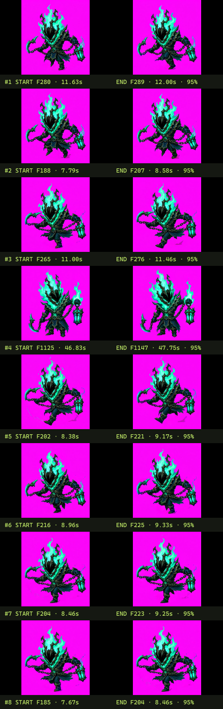
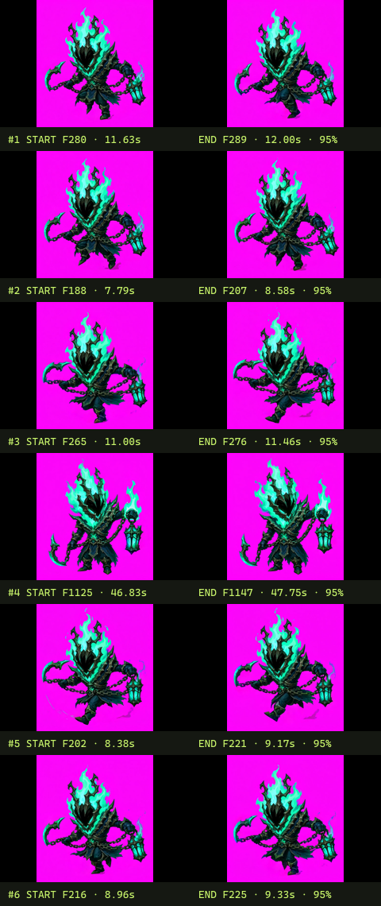
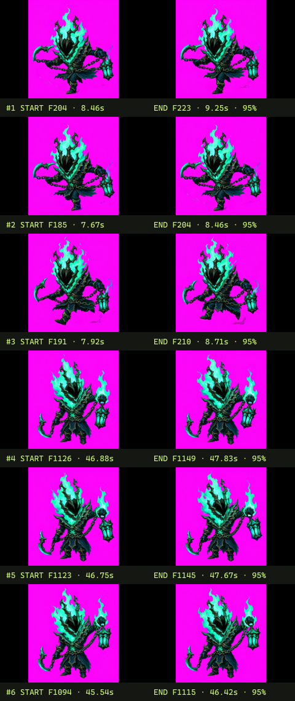
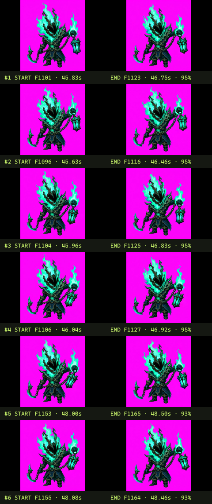
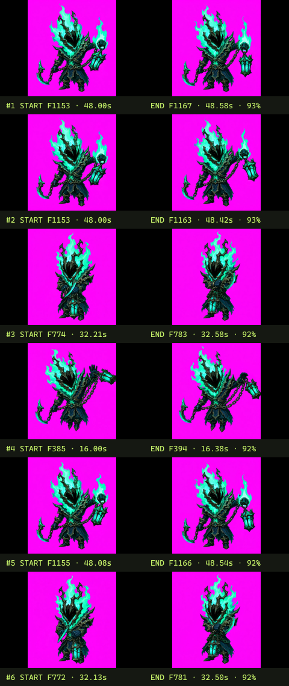
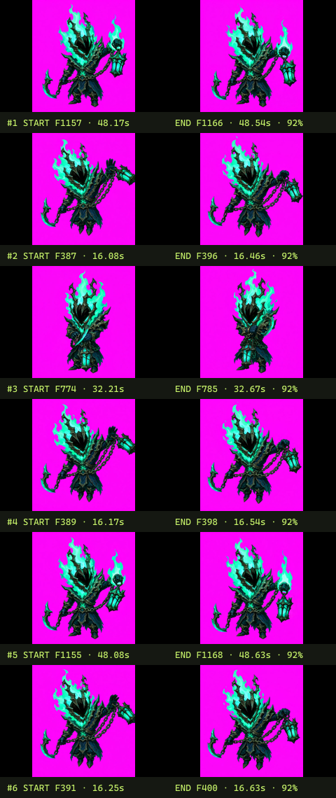
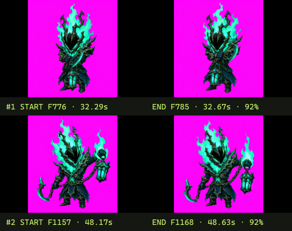

# 《视频合成.mp4》循环动作分析报告

> 生成时间：2026-07-15 23:15（Asia/Shanghai）  
> 分析方式：真实调用本项目 MCP 服务  
> MCP 报告 ID：`7632f7d4-6f34-4a7d-b689-6065f3bd8718`

## 1. 结论摘要

当前工具已经形成可工作的完整链路：**读取视频元数据 → 流式扫描全片 → 自动提出循环候选 → 分页回传候选首尾帧 → AI 复核动作语义**。

本次完整扫描 54.759 秒视频，共采样 1,314 帧。算法给出 32 个原始循环候选；经 AI 观察 MCP 返回的首尾帧接缝图，可归并为约 **5 个动作簇**，主要包括：

1. 横向移动 / 奔跑或冲刺循环；
2. 移动动作中的短摆动回环；
3. 向右挥击、伸展或提灯动作；
4. 正面待机 / 呼吸循环；
5. 侧身悬浮待机 / 提灯摆动循环。

工程链路已经可用，但“32 个算法候选”还不能直接等同于“32 个独立动作”。当前最明显的不足是候选重复较多、同背景下的动作段没有被识别为场景切分，以及只看首尾帧时动作语义仍有歧义。

## 2. 输入与运行参数

| 项目 | 数值 |
|---|---:|
| 输入文件 | `C:\Users\17781\Downloads\视频合成.mp4` |
| 视频时长 | 54.759 秒 |
| 分辨率 | 912 × 992 |
| 源视频平均帧率 | 23.8503 FPS |
| 编码 / 容器 | H.264 / MP4 |
| 分析采样率 | 24 FPS |
| 最短循环 | 0.4 秒 |
| 最长循环 | 4 秒 |
| 分析窗口 | 20 秒 |
| 窗口重叠 | 4 秒 |

实际调用的 MCP 工具：

1. `inspect_video`
2. `analyze_video_loop`
3. `read_analysis_report`
4. `review_video_loop_candidates`

## 3. 流式扫描结果

| 指标 | 结果 |
|---|---:|
| 全片采样帧 | 1,314 |
| 分析窗口 | 4 |
| 峰值缓存分析帧 | 480 |
| 原始循环候选 | 32 |
| 重复帧组 | 58 |
| 检出的场景切换 | 0 |

最后一个分析窗口覆盖到 54.708 秒，距视频结束约 0.051 秒，说明全片确实被扫描，没有因长度上限提前截断。峰值只保留 480 个低分辨率分析帧，内存占用与视频总长度解耦。

算法估计的主要短周期为 10、12、14、16、18、20 帧；24 FPS 下约为 0.42–0.83 秒。这解释了为什么很多候选是角色火焰、肢体、锁链或提灯摆动的“微循环”，而不是一整段长动作。

## 4. MCP 首轮候选总览

下图由 `analyze_video_loop` 直接作为 MCP 图片内容返回，展示评分最高的 8 个候选首尾帧。每一行左侧是起始帧，右侧是结束帧。

从总览可以看出，首尾外观相似度较高；但多个候选实际上集中在相同时间段，是同一动作周期的不同相位或轻微偏移。

## 5. AI 动作语义复核

以下语义判断仅基于 MCP 回传的首尾帧。名称是 AI 推断，不是视频内已有标签。

| 动作簇 | 代表候选排名 | 时间范围 | 算法置信度 | AI 判断 | 语义把握 |
|---|---|---:|---:|---|---|
| A | #2、#5–#9 | 7.67–9.33 秒 | 94.9%–95.3% | 横向移动、奔跑或冲刺循环；腿部和下摆发生周期位移 | 中 |
| B | #1、#3 | 11.00–12.00 秒 | 95.1%–95.5% | 移动动作中的短摆动回环，可能是同一 locomotion 动画的另一相位 | 中低 |
| C | #22、#26、#28、#30 | 16.00–16.63 秒 | 92.0%–92.5% | 右臂、锁链或提灯向右伸展，接近挥击 / 施法动作中的微循环 | 中 |
| D | #21、#24、#27、#31 | 32.13–32.67 秒 | 91.9%–92.5% | 正面站立的待机 / 呼吸 / 火焰跳动循环 | 中高 |
| E | #4、#10–#20、#23、#25、#29、#32 | 45.54–48.63 秒 | 91.7%–95.1% | 侧身悬浮待机或提灯摆动；存在多个高度重叠的子周期 | 中高 |

这里的“算法置信度”表示接缝与周期性启发式评分，不代表动作名称正确率。动作语义仍需要结合中间帧、运动方向或上下文进一步确认。

## 6. 分页候选接缝图

### 第 1 页：排名 #1–#6

主要覆盖 7.79–12.00 秒的移动微循环，以及 46.83–47.75 秒的侧身提灯 / 悬浮动作。

### 第 2 页：排名 #7–#12

继续出现 7.67–9.25 秒的移动候选和 45.54–47.83 秒的提灯候选，说明当前排序会保留同一动作的多个相位偏移。

### 第 3 页：排名 #13–#18

候选几乎都属于 45.63–48.50 秒的同一个侧身悬浮 / 提灯摆动动作簇。

### 第 4 页：排名 #19–#24

除了提灯摆动外，开始出现正面待机（约 32.2 秒）和向右伸展 / 挥击（约 16.0 秒）候选。

### 第 5 页：排名 #25–#30

主要是三个动作簇的相邻相位：提灯摆动、向右伸展 / 挥击、正面待机。

### 第 6 页：排名 #31–#32

最后两个候选分别是正面待机微循环和提灯摆动微循环。

## 7. 当前能力评价

### 已经做得比较好的部分

- **全片覆盖**：54.759 秒视频完整扫到末尾，没有固定帧数或长度截断。
- **内存有界**：流式解码配合重叠窗口，峰值分析缓存为 480 帧。
- **全局帧号正确**：候选能定位到 7 秒、16 秒、32 秒、48 秒等不同位置。
- **MCP 多模态闭环可用**：AI 能拿到结构化候选数据和真实首尾帧图片。
- **长结果可分页**：32 个候选拆成 6 页读取，没有撑爆单次 MCP 响应。

### 目前暴露出的不足

1. **动作分段不足**：本片显然包含不同姿态 / 动作段，但 `sceneCuts = 0`。同一纯色背景下，仅靠传统场景切换阈值不够。
2. **候选去重不足**：32 个候选经语义观察只有约 5 个动作簇；需要时间区间 IoU、周期相位和视觉嵌入联合去重。
3. **首尾两帧不足以稳定命名动作**：可以判断接缝是否接近，但难以区分“跑、冲刺、受击、施法”等具有相似姿态的动作。
4. **置信度容易被误解**：91%–95% 是闭环质量的相对分数，并非语义正确概率，需要重新命名或校准。
5. **偏向微循环**：当前容易抓到 10–24 帧的局部摆动周期，不一定覆盖完整动作起势、主体和收势。

## 8. 下一步最值得增加的能力

若要从“能找闭环”提升到“能自动整理完整动作序列”，建议优先补充：

1. **候选动作簇聚合**：把高度重叠、周期相近的候选合并，每个动作只给 AI 1–3 个代表区间。
2. **多关键帧回传**：每个候选回传起点、25%、50%、75%、终点五帧，或直接返回小型 GIF / WebP 动图。
3. **动作边界模型**：在同背景角色动画中，根据姿态嵌入、运动能量和周期稳定区间切段，而不是只依赖场景切换。
4. **结构化 AI 复核结果**：让 AI 返回 `action_name`、`is_complete_action`、`is_seamless`、`recommended_range`、`reason`，并由程序二次排序。
5. **区分微循环与完整动作**：同时输出“最短基本周期”和“完整动作包络”，避免把火焰抖动误当作角色完整动作。

## 9. 综合判断

当前版本已经证明 MCP + 流式算法 + 多模态 AI 的技术链路成立，适合用作候选发现和人工 / AI 辅助筛选工具。若目标是“一次丢入任意动画视频，自动得到去重且命名准确的完整序列帧集合”，目前仍属于可用的 Alpha：底层扫描与回传能力已经具备，下一阶段的主要工作应从性能转向**动作级分段、候选聚类和多帧语义复核**。

---

原始结构化输出保存在 [`analysis-data.json`](./video-analysis-assets/analysis-data.json)，其中包含媒体信息、全部窗口、32 个候选的帧号 / 时间戳 / 诊断指标，以及各页 MCP 图片元数据。
